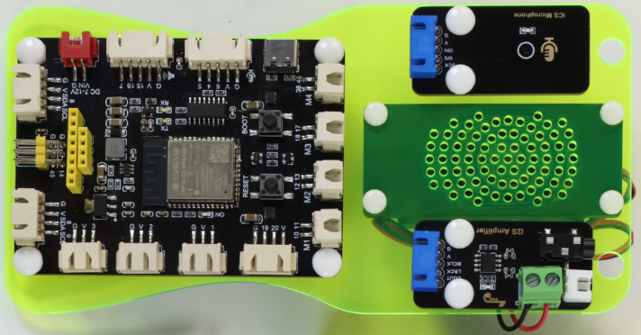
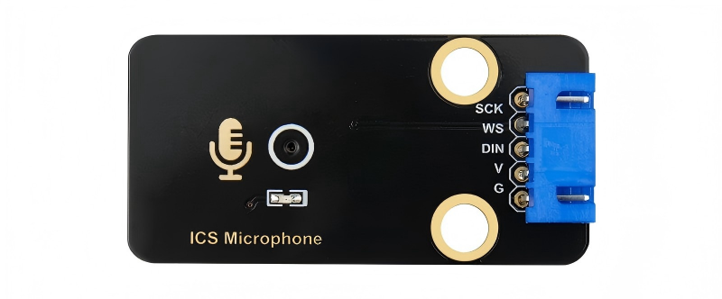
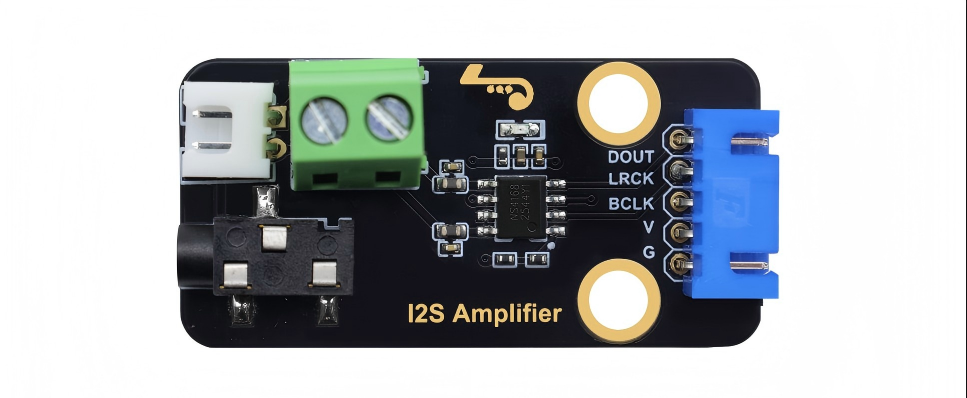
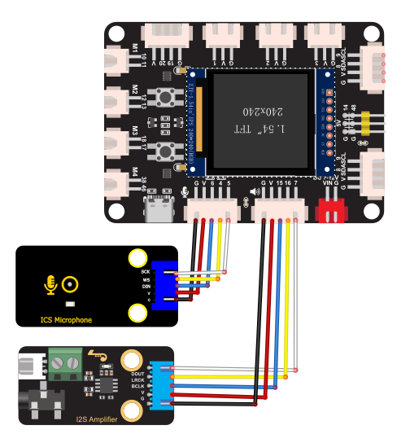
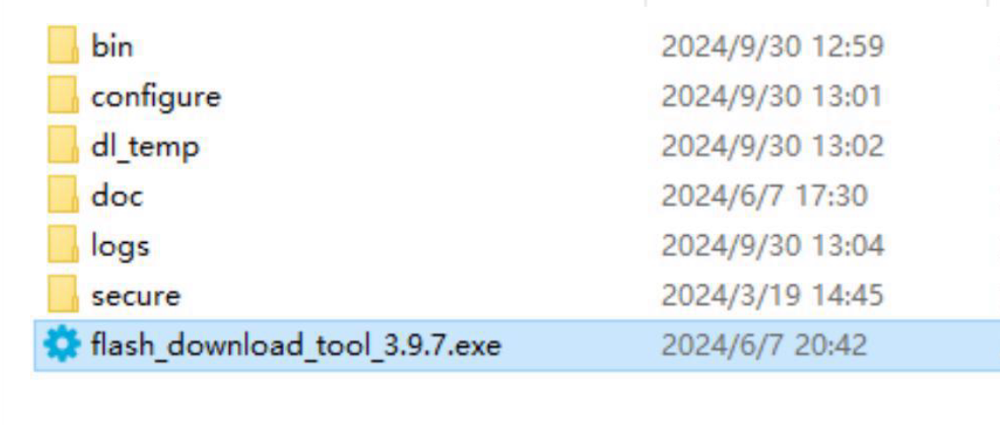
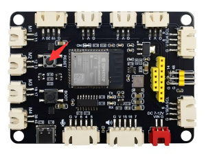
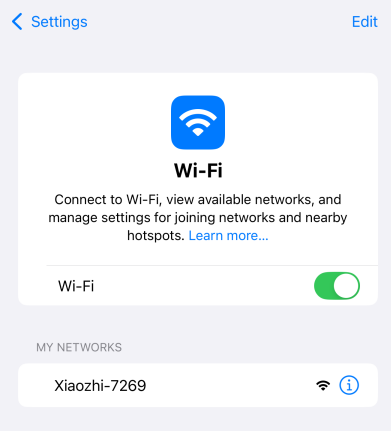
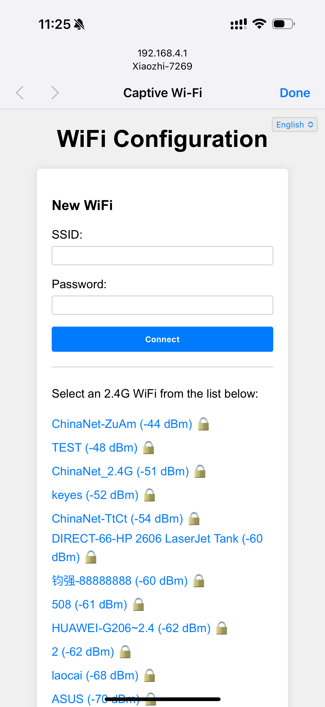
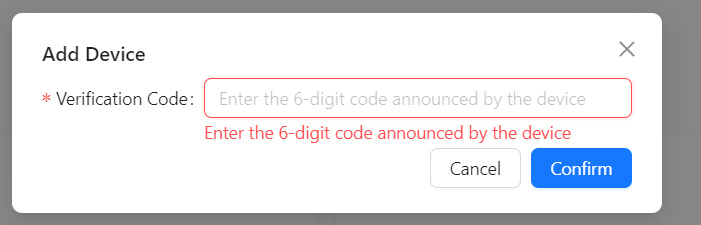

# KS5030 Ready‑to‑Use ESP32‑S3‑Rover XiaoZhi AI Chatbot DIY Kit (Mobile Version with 1.54‑inch LCD Screen)

## Introduction
Built with modular hardware and local speech‑recognition technology, this is the “XiaoZhi AI Chatbot” interactive kit. It features an ESP32‑S3 main controller, MEMS digital microphone (ICS‑43432), digital power amplifier (NS4168), 1.54‑inch color LCD screen and loudspeaker. It supports voice input and real‑time audio broadcast for basic human‑machine interaction. A battery holder and USB cable are included. It powers‑on immediately with external power and can run untethered with batteries installed. Furthermore, the board integrates four‑channel motor drivers, dual screen interfaces and abundant peripheral expansion resources. It can be flexibly adapted for advanced development projects such as AI voice‑controlled cars and Wi‑Fi remote‑controlled robots, balancing beginner‑friendly experience with room for technical growth.

## Key Features
- **Multi‑function Mainboard for Advanced Projects**: On‑board motor drivers, dual screen interfaces and rich peripheral pins enable easy upgrade from chatbot to AI car or remote‑controlled robot.
- **High‑Integration, Ready‑to‑Run**: Mainboard and functional modules are pre‑mounted on an acrylic frame. Simple wiring completes assembly; no soldering or breadboard jumper wires required.
- **Voice Input**: Built‑in MEMS digital microphone (ICS‑43432) effectively suppresses ambient‑noise interference.
- **Audio Output**: Digital power amplifier (NS4168) plus enclosed‑cavity loudspeaker delivers clear voice playback.
- **Expandable**: The expansion board breaks out extra GPIO, I²C and other interfaces via XH connectors for adding more sensors or functional modules to the robot.
- **Portable**: Supports battery‑holder power supply (6‑9 V) for untethered mobile operation without USB cable.
- **Education‑Friendly**: Hands‑on assembly and debugging help users understand basic principles of AI speech recognition and audio playback.

## Bill of Materials

| Hardware Item | Specification / Model | Main Purpose | Related Image (Example) |
| :--- | :--- | :--- | :--- |
| Assembled chassis (no pre-wiring) | ESP32-S3-Rover Xiaozhi AI Chat Robot Pre-assembled Semi-finished Unit | Fix mainboard, easy wiring, complete assembly set for building Xiaozhi AI voice robot |  |
| Display Screen                    | 1.54‑inch TFT LCD, ST7789 driver, 240×240                    | Displays status and conversation content                     |                 |
| Type‑C USB Cable                  | USB2.0 Type‑C, white, 1 m                                    | Connects development board to PC for firmware flashing and debugging |                 |
| Dupont Wires                      | 5‑pin female‑to‑female, 100 mm                               | Inter‑module wiring between modules and mainboard            |            |

## Hardware Introduction

### 1. S3 AI Rover Development Board

The S3 AI Rover mainboard is built around the ESP32‑S3‑WROOM‑1‑N16R8 module, featuring 16 MB Flash and 8 MB PSRAM. It incorporates a mature power‑supply scheme, dual DRV8835 four‑channel motor drivers, and rich peripheral interfaces including I2S audio, dual screen ports (SPI and I2C), ultrasonic sensor and servo expansion headers. It fits many development scenarios such as AI voice‑controlled cars, Wi‑Fi remote‑controlled robots and educational programmable chassis. Reset and BOOT buttons are provided for debugging and network provisioning.

#### Main Features

- **High‑Performance Processing**
  - Dual‑core Xtensa® LX7 architecture with CPU frequency up to 240 MHz
  - Hardware‑accelerated machine‑learning to speed‑up AI‑application inference

- **Wireless Connectivity**
  - Integrated 2.4 GHz 802.11 b/g/n Wi‑Fi
  - Bluetooth 5.0 and Bluetooth Low Energy (BLE) for multi‑scenario short‑range communication

- **On‑Board Drivers & Peripherals**
  - Two DRV8835 ICs for independent four‑wheel drive
  - Dual screen interfaces: 8‑pin SPI LCD port + 4‑pin I2C screen port
  - Complete I2S hardware: microphone input together with power‑amplifier speaker output

- **Power Management**
  - VIN DC input: 7‑12 V for main system power supply
  - USB Type‑C provides 5 V power input and program downloading
  - On‑board DC‑DC converter outputs 5 V / 2 A; AMS1117 LDO outputs 3.3 V / 900 mA

- **Security Features**
  - Hardware encryption engine (AES, SHA, RSA, etc.)
  - Supports Secure Boot and Flash Encryption

- **Development Ecosystem**
  - Supports Arduino IDE for fast prototyping
  - Compatible with advanced frameworks such as ESP‑IDF and PlatformIO

### 2. MEMS Digital Microphone (ICS‑43432)

#### Introduction
ICS‑43432 is a MEMS‑fabricated digital microphone integrating pre‑amplifier, ADC and I²S output. Compared with traditional analog microphones, it effectively reduces noise interference and is widely used in speech‑recognition and interactive‑audio projects.

#### Features
1. **I²S Digital Output**: Direct digital‑audio output avoids analog‑cable interference.
2. **Compact Form Factor**: Suitable for space‑constrained projects.
3. **Low‑Power Operation**: Battery‑supply friendly.
4. **Omnidirectional Pick‑up**: 360‑degree audio capture for voice interaction.
5. **High Sensitivity**: Captures faint sound for speech‑recognition applications.
6. **On‑board Regulator & Clock**: Reduces external‑circuit requirements and simplifies wiring.

#### Main Specifications

| Parameter              | Value / Range             | Remarks                                        |
|-------------------|-------------------------|---------------------------------------------|
| **Operating Voltage**      | 3.3 V ~ 5 V           | 3.3 V recommended                            |
| **Output Interface**      | I²S                     | Left‑aligned, mono output                          |
| **Signal‑to‑Noise Ratio**        | ~65 dB                 | Higher SNR yields cleaner audio                      |
| **Sensitivity**        | -26 dBFS (typical)        | Measured at 94 dB SPL, 1 kHz input             |
| **Frequency Response**      | 50 Hz ~ 20 kHz   | Covers human‑speech and music range                     |
| **Supply Current**      | 1.1 mA ~ 1.7 mA         | Typical operating current                                |
| **Module Size**      | 48 mm × 24 mm       | Uniform footprint shared by multiple modules                              |

### 3. Digital Power Amplifier (NS4168)

#### Description
This module uses the NS4168 chip: a high‑efficiency, low‑noise, highly‑integrated Class‑D audio‑power amplifier, especially suited for portable audio devices with strict power‑consumption and anti‑interference requirements. Its I²S digital input, anti‑clipping function and comprehensive protection mechanisms make it widely adopted in consumer‑electronics audio products.

#### Features
1. **I²S Digital Input**: No external DAC required, simplifying system design.
2. **High‑Efficiency Class‑D**: Efficiency above 80 %, suitable for battery‑powered scenarios.
3. **Automatic Sample‑Rate Detection**: Supports wide 8 kHz‑96 kHz range with adaptive operation.
4. **Built‑in Digital High‑pass Filter**: Single‑pin pulse sets corner frequency for flexible adjustment.
5. **Left / Right Channel Selectable**: Channel assignment easily configured via CTRL pin logic level.
6. **NCN Anti‑Clipping**: Effectively suppresses clipping distortion and preserves audio quality.
7. **No Output Filter Required**: Reduces peripheral components and saves space.
8. **Protection Circuits**: Over‑current, over‑temperature and under‑voltage protection for safer operation.
9. **Headphone Jack**: On‑board 3.5 mm TRRS jack supports direct connection of headphones or loudspeakers.

#### Main Specifications

| Parameter             | Value / Range       | Remarks                        |
|------------------|-------------------|-----------------------------|
| **Operating Voltage**     | 3.0 V ~ 5.5 V       | Typically 3.3 V or 5 V             |
| **Output Power**     | 2.5 W @4Ω (5 V)      | Depends on supply voltage and thermal conditions        |
| **Efficiency**         | >80 %     | Effectively reduces power dissipation             |
| **Sample Rate**       | 8 kHz ~ 96 kHz      | Auto‑detection and adaptive       |
| **THD+N**        | 0.2 % @1 W, 5 V, 4Ω  | Guarantees good audio fidelity                 |
| **Protection Features**     | Over‑temp / over‑current / under‑voltage | Enhances operational safety                   |
| **Module Dimensions**     | 48 mm × 24 mm       | Uniform footprint shared by multiple modules               |
| **Weight**         | 7.29 g             | Lightweight and portable                     |
| **Package Form**     | eSOP8             | Enhanced thermal‑dissipation package               |

> **Note**: Allow adequate cooling space. Match loudspeaker impedance (4Ω or 8Ω recommended). Set appropriate gain to avoid distortion or chip damage.

### 4. Enclosed‑Cavity Loudspeaker (8Ω 2 W )

#### Introduction
This speaker works inside a closed or semi‑closed cavity to optimize low‑frequency response and concentrate acoustic energy. It is widely used in portable speakers and smart voice‑enabled devices.

#### Features
1. **Impedance‑Power Matching**: 8Ω impedance, 2 W rated power, suitable for small amplifiers.
2. **Improved Low‑Frequency Response**: Cavity design enhances bass performance.
3. **Compact Mechanical Design**: Frequently supplied with snaps or screw holes for easy integration.
4. **Broad Application Range**: Works for various ambient‑volume requirements.

#### Main Specifications

| Parameter          | Value / Range       | Remarks                              |
|---------------|-------------------|-----------------------------------|
| **Impedance**      | 8Ω           | General‑purpose specification matching small amplifiers              |
| **Rated Power**  | 2 W              | For normal‑volume playback                      |
| **Frequency Response**  | ~200 Hz ~ 20 kHz     | Cavity‑optimized mid‑low‑frequency performance                |
| **Sensitivity**    | 80‑90 dB (@1 W/1 m)  | High sensitivity and good energy efficiency              |
| **Mounting Method**  | Screws / snaps / adhesive tape    | Depends on physical variant                    |

> **Note**: Pair with a suitable digital amplifier and calibrate volume to prevent overload‑caused distortion or hardware damage.

### 5. 1.54‑inch IPS Color LCD Module

#### Introduction
The 1.54‑inch IPS color LCD module is a high‑performance display unit for various electronic projects and products. Adopting advanced IPS technology, it delivers rich colors and sharp visuals for scenarios requiring high visibility. Its compact footprint and simple interface make it well‑suited for embedded development and portable devices.

#### Features
- **High Resolution**: 240 × 240‑pixel resolution delivers sharp, detailed visuals.
- **Rich Color Depth**: Supports RGB 65 K color display for vivid, lifelike images.
- **Wide‑View‑Angle IPS Panel**: IPS technology provides ultra‑wide viewing angles while maintaining good image quality at oblique viewing positions.
- **Simple Interface**: Uses 4‑wire SPI serial bus and requires few GPIO pins.
- **Broad Compatibility**: Rich sample code for STM32, C51, MSP430 simplifies development and integration.

#### Product Parameters

| Item | Parameter |
| --- | --- |
| **Display Colors** | RGB 65 K color |
| **SKU** | MSP1541 |
| **Screen Size** | 1.54 inch |
| **Panel Technology** | TFT |
| **Driver IC** | ST7789 |
| **Resolution** | 240 × 240 pixels |
| **Display Interface** | 4‑line SPI interface |
| **Active Display Area (AA Region)** | 27.72 mm × 27.72 mm |
| **Touch‑Screen Type** | No touch screen |
| **Touch IC** | None |
| **Module PCB Base Dimensions** | 32.00 mm × 43.72 mm |
| **Viewing Angle** | Full‑angle |
| **Operating Temperature** | -10 ℃ ~ 60 ℃ |
| **Storage Temperature** | -20 ℃ ~ 70 ℃ |
| **Operating Voltage** | 3.3 V |

# Hardware Wiring Instructions

**All modules plug directly into dedicated connectors on the expansion board.**

**Notice**: Different manufacturers may assign ESP32‑S3 board pins differently. Always refer to the silkscreen and official documentation for your specific board!

## Wiring Diagram

## Microphone Interface

| **ESP32‑S3 Development Board** | **ICS‑43432 Microphone (I²S Interface)** |
| --- | --- |
| GPIO **4** | **WS** (Word Select) |
| GPIO **5** | **SCK** (Bit Clock) |
| GPIO **6** | **DIN** (Data Input) |
| **3V3** | **VDD** (Power, 3.3 V) |
| **GND** | **GND** (Ground) |

---

## Power‑Amplifier Interface

| **ESP32‑S3 Development Board** | **NS4168 Digital Power Amplifier** |
| --- | --- |
| GPIO **7** | **DOUT** (Digital Audio Output) |
| GPIO **15** | **BCLK** (Bit Clock) |
| GPIO **16** | **LRCK** (Left‑Right Clock) |
| **3V3** | **VCC** (Power Input) |
| **GND** | **GND** (Ground) |

---

## LCD Screen Interface

| **ESP32‑S3 Development Board** | **1.54‑inch IPS Color LCD** |
| --- | --- |
| GPIO **21** | **SCL** (SPI Clock Signal) |
| GPIO **47** | **SDA** (SPI Data Signal) |
| GPIO **45** | **RES** (Reset Signal) |
| GPIO **40** | **DC** (Data / Command Select Signal) |
| GPIO **41** | **CS** (Chip‑Select Signal) |
| GPIO **42** | **BLK** (Backlight‑Control Signal; high level = backlight ON) |
| **3V3** | **VCC** (Power, 3.3 V) |
| **GND** | **GND** (Ground) |

## Assembly Flowchart

# Firmware Flashing

Two flashing methods are available: **Web‑based Online Flashing** and **Offline Download‑Tool Flashing**. Online flashing is recommended for simplicity and speed.

## Method 1: Web‑based Online Flashing
This method flashes firmware directly from a web browser without installing extra software.

**1. Pre‑requisites**
- **Browser**: Latest‑version **Google Chrome** or **Microsoft Edge**.
- **USB Cable**: Ensure your Type‑C cable supports data transmission (not charge‑only).

**2. Flashing Steps**

1.  **Access the Flashing Page:** Open the online flashing URL in your browser: **https://flash.keyestudio.com/**  

2.  **Connect Hardware**: Select KS5030 preset. Connect the ESP32‑S3‑Rover kit to your PC with Type‑C cable.
3.  **Connect Device in Browser**:
    -   Click **Connect Device** on the webpage.
    -   A port‑selection popup appears. Choose your target **COM port** (e.g. `COM3`, `COM4`) and click connect.
4.  **Load Firmware**:
    -   **Option A (Recommended)**: Download firmware from GitHub or Gitee repository. Select the newest firmware release and click **Download & Add**. Firmware loads automatically.
    -   **Option B**: If you already have firmware locally, click **Upload Firmware** and select your local `.bin` file.
5.  **Start Flashing**: After firmware is loaded, click **Start Flashing**.
6.  **Complete**: Wait for progress bar to finish until log shows “Flash Success”.

After successful flashing, press the `RST` button on the board to reboot the device and enter Wi‑Fi provisioning mode.

## Method 2: Flash Download Tool (No ESP‑IDF Environment Required)

**Important**: This procedure applies to **ESP32‑S3** firmware. Make sure you obtain the correct firmware binary.

Download link for flashing‑tool package

 [**Flash‑Tool Archive**](flash‑tool.rar)

### 1. Preparation
- **Operating System**: Windows example; **Flash Download Tool version 3.9.7 or newer** is recommended.
- **Obtain Tool**: Download from [Espressif official website](https://www.espressif.com/en/support/download/other-tools), unzip to any folder; no installation required.
- **Launch**: Open extracted folder and double‑click `flash_download_tool_3.9.7.exe`.

### 2. Download Firmware

Download link for firmware archive

 [**Firmware Archive**](KS5030-EN-v1.5.5_bread-compact-wifi-LCD-7P-240x240.bin)

### 3. Flash Firmware onto Development Board

Unzip and open `flash_download_tool` folder, run `flash_download_tool.exe`.

**1) Download Configuration**

1.  **ChipType**: Select `ESP32‑S3`
2.  **WorkMode**: Select `Develop`
3.  **Download Mode**: Select `UART`

**2) Load Firmware & SPI Download Settings**

1.  Click `...` button on the first entry and select your mainboard‑compatible `.bin` firmware file.
2.  Tick the checkbox before your firmware entry and set flash address to `0x0` or `0x00` (flash from start address).
3.  Select corresponding COM port (check Windows Device Manager for port number).
4.  Set baud‑rate (e.g. `921600`) for faster flashing speed.
5.  **Enter Download Mode**: **Hold down the BOOT (IO0) button on ESP32‑S3 board, press and release RST button, then release BOOT button.**
6.  Click `START`. Observe progress bar until **FINISH** success status appears.

## After‑Flashing

Press the `RST` button on the board after flashing completes. The device enters **Wi‑Fi provisioning mode**.

# How to Configure Device Wi‑Fi

## 1. Wi-Fi Network Configuration

### 1) Start Device
- After flashing firmware and rebooting, the device enters configuration mode.

### 2) Configuration Status
- **sRGB LED blue blinking:** Indicates the device is in Wi-Fi configuration mode.  
- If the device is not in configuration mode, press and hold the **BOOT (or IO0)** button for a few seconds, or power cycle to enter configuration mode.

### 3) Configuration Steps
1.  **Connect to "Xiao Zhi" Wi-Fi**  
    Use your phone or computer to search for Wi-Fi and connect to the device’s hotspot (usually named *Xiaozhi-XXXXXX*).  
    

2.  **Configure Network**  
    After connecting, the phone typically auto-displays the configuration page. If not, open a browser and navigate to `http://192.168.4.1`.  
      
    > - Select your 2.4G Wi-Fi network (5G is not supported).  
    > - Enter the Wi-Fi password and click **Connect**.  
    > - If the connection succeeds, the interface shows “Done,” and the device will reboot and connect to your Wi-Fi.

---

## 2. About the sRGB LED on the Device

1.  **Connection and Update Status**  
    -   **Blue flashing:** Device is in Wi-Fi configuration mode.  
    -   **Blue steady:** OTA firmware update in progress.  
    -   **Green flashing:** Wi-Fi connected successfully, waiting for wake-up.  
    -   **Blue light during voice wake-up:** Connecting to server.  
    -   **Green steady:** Playing voice.  
    -   **Red steady:** Recording audio.

2.  **sRGB LED Does Not Light**  
    -   Check if the development board power supply is normal.  
    -   Some boards may require additional soldering or jumper shorting to enable onboard sRGB LED, please check your board manual.

---

## 3. How to Add a Device

1. **Confirm Device Is Online**  
   - Once connected to the network, the device will announce a 6-digit verification code (can be retrieved by waking it up again).

2. **Access Control Panel**  
   - Open the [Xiao Zhi AI Chatbot - Control Panel](https://xiaozhi.me/) by entering [https://xiaozhi.me](https://xiaozhi.me) in your browser (register if you don’t have an account). Click the top right corner to switch to your preferred language.  
   

After changing the language, click **console** to enter the control panel.

3. **Device Management**  
   - Create an agent,  
   

   - Set your agent's name.  
   

   - Click “Add New Device.”  
   
     
   Enter the 6-digit **Device ID**.  

     

   **Where to get the Device ID:** After firmware upload and network setup succeed, the device will announce this six-digit code automatically.

4. **Activation Successful**  
   - The device will activate automatically and appear in the “Device Management” page. Click **Configure Role** to open the configuration interface.  
   

   - Set the assistant’s name and voice. In the Role Introduction section, you can use AI tools to write a character description as you like.  
   

   - Configure AI large models with several optional settings. After finishing, save your settings.  
   

Restart the Xiao Zhi AI Chatbot and start chatting!

## FAQ‑Common Troubleshooting

1. **No speaker sound, microphone no input or LCD remains blank**
‑ Confirm battery‑holder power switch is ON and power supply is stable. Check that modules are firmly inserted into correct dedicated ports (speaker, microphone, screen) with correct orientation.

2. **Device reboots frequently or fails to boot**
‑ Low battery voltage may cause unstable power rails. Replace with fresh AA batteries when using battery‑holder power; verify correct battery polarity.

3. **XiaoZhi hotspot cannot be found during Wi‑Fi setup**
‑ Confirm firmware flashed correctly. Press `RST` to reboot. If provisioning does not trigger automatically, long‑press `BOOT` button for several seconds to force provisioning‑mode entry.

4. **Firmware‑flash failure, cannot connect to board**
‑ Verify you are using a data‑capable Type‑C cable (not charge‑only). Confirm serial driver installation. If problems persist: hold `BOOT`, press‑and‑release `RST`, release `BOOT` to enter download mode and retry flashing.

> **Tip**: All functional modules connect via unified main‑board ports. Double‑check modules are fully seated. If issues remain, confirm firmware version matches your hardware configuration.