# KS5038 Ready‑to‑Use ESP32‑S3‑Cam XiaoZhi AI Chatbot DIY Kit (Camera Version with 1.54‑inch LCD Screen)

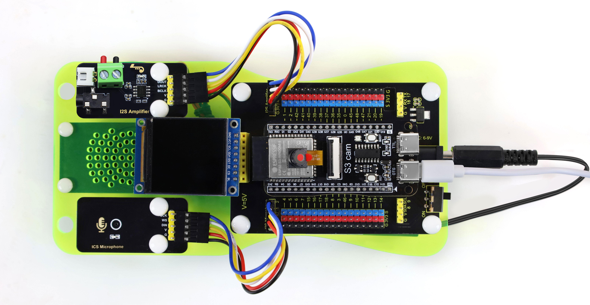

## Introduction
Based on modular hardware and local speech recognition technology, this kit builds the "XiaoZhi AI Chatbot" interactive solution. It is equipped with an ESP32‑S3 main controller, camera, MEMS digital microphone (ICS‑43432), digital power amplifier (NS4168), 1.54‑inch color LCD screen and loudspeaker. It supports voice input and real‑time audio broadcast, and adds visual recognition capability for richer AI interaction experiences. A battery holder and USB cable are included. It can run immediately with external USB power, and supports portable operation with batteries installed.

## Key Features
- **Vision Enhancement**: Integrated camera module gives the robot "eyes" for image recognition, monitoring and other scenarios.
- **High‑Integration, Ready‑to‑Run**: Mainboard, expansion board and functional modules are pre‑mounted on an acrylic frame. Simple wiring completes assembly; no soldering or breadboard jumper wires required.
- **Voice Input**: Built‑in MEMS digital microphone (ICS‑43432) effectively suppresses ambient noise.
- **Audio Output**: Digital power amplifier (NS4168) plus enclosed loudspeaker delivers clear voice playback.
- **Expandable**: The expansion board exposes extra GPIO, I²C and other interfaces via 2.54mm pin headers for connecting additional sensors and modules.
- **Portable**: Supports battery‑holder power supply (6‑9 V) for untethered mobile use.
- **Education‑Friendly**: Hands‑on assembly and debugging help users understand basic principles of AI speech recognition and audio playback.

## Bill of Materials

| Hardware Item | Specification / Model | Main Purpose | Image |
| --- | --- | --- | --- |
| Main Development Board | ESP32‑S3‑Cam | Main controller, runs firmware, handles audio‑video and network connectivity | 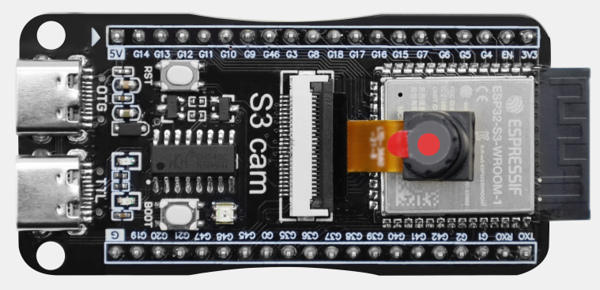 |
| Assembled chassis (no pre-wiring) | ESP32-S3-Cam Xiaozhi AI Chat Robot Pre-assembled Semi-finished Unit | Fix mainboard, easy wiring, complete assembly set for building Xiaozhi AI voice robot | 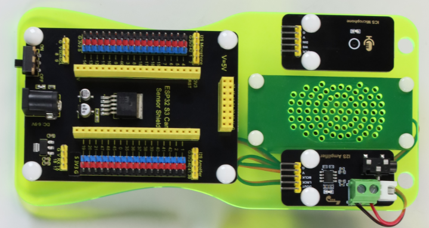 |
| Display Screen                    | 1.54‑inch TFT LCD, ST7789 driver, 240×240                    | Displays status and conversation content                     | 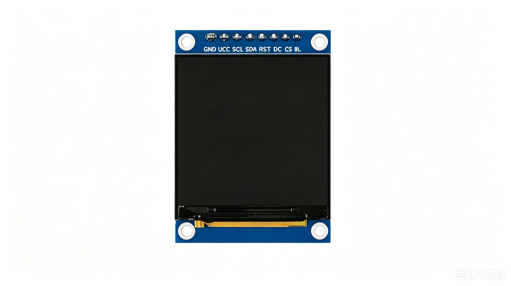                |
| Type‑C USB Cable                  | USB2.0 Type‑C, 1 m                                           | Connect board to PC for firmware flashing and debugging      |                 |
| Dupont Wires                      | 5‑pin female‑to‑female, 100 mm                               | Inter‑module wiring                                          | 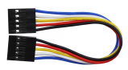           |

### 1. ESP32‑S3‑Cam Development Board

ESP32‑S3‑Cam is a vision‑oriented development board built on the Espressif ESP32‑S3 SoC with integrated Wi‑Fi and Bluetooth. It features an on‑board camera connector, micro‑SD card slot and multiple exposed GPIO pins, making it ideal for IoT camera and vision‑recognition projects.

**Main Features**
- **High‑Performance Processing**: Dual‑core Xtensa® LX7 CPU up to 240 MHz with AI hardware acceleration.
- **Camera Interface**: 24‑pin FPC camera connector for external camera modules.
- **Wireless Connectivity**: 2.4 GHz Wi‑Fi and Bluetooth 5.0 (BLE).
- **Rich Interfaces**: Exposed GPIO supporting I²S, I²C, SPI, UART for microphones, amplifiers and other peripherals.
- **Storage Expansion**: On‑board micro‑SD card slot on some variants for image and firmware storage.

### 2. ESP32‑S3‑Cam AI Sensor Shield Expansion Board

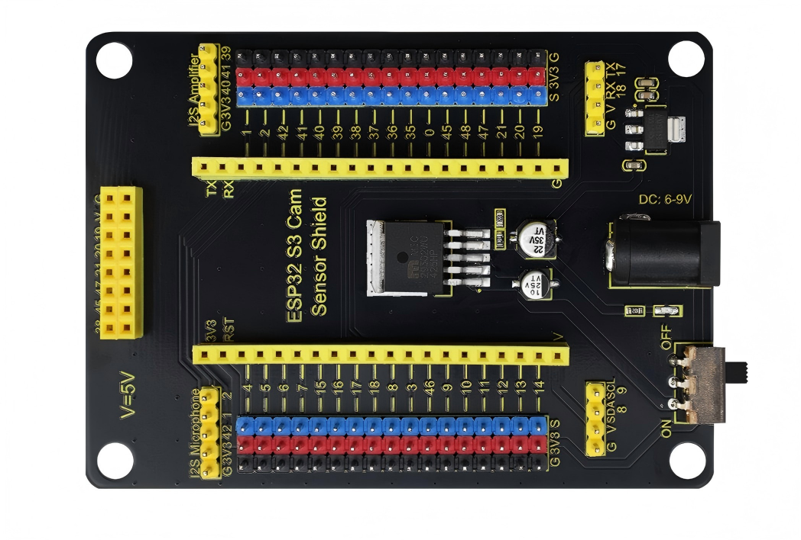

#### Introduction
The ESP32‑S3‑Cam AI Sensor Shield expands the pinout of the ESP32‑S3‑Cam via 2.54 mm headers. It brings out I²C, I²S, UART and the dedicated 1.54‑inch LCD connector. Power can be fed through the DC jack (6‑9 V DC) with an on‑board slide power switch. Four M4 mounting holes are compatible with Lego‑style building blocks.

#### Specifications

| Parameter | Value |
| --- | --- |
| **Operating Voltage** | DC 6‑9 V |
| **Average Operating Current** | 60 mA |
| **Max Output Current** | 5 V / 2 A |
| **Operating Temperature** | -25 ℃ ~ +65 ℃ |
| **Dimensions** | 88 mm × 64 mm × 15 mm |
| **Weight** | 35.8 g |

### 3. MEMS Digital Microphone (ICS‑43432)

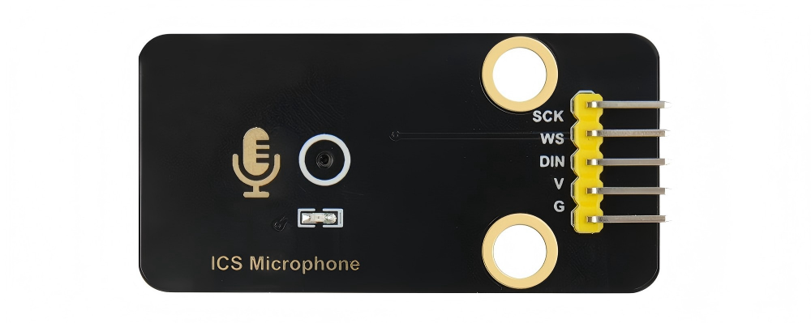

#### Introduction
The ICS‑43432 is a MEMS‑based digital microphone integrating pre‑amplifier and ADC with I²S output. Compared with analog microphones, it reduces cabling noise and is well‑suited for speech‑recognition and interactive‑audio projects.

#### Features
1. **I²S Digital Output**: Direct digital audio output avoids analog‑signal interference.
2. **Compact Form Factor**: Suitable for space‑constrained builds.
3. **Low‑Power Operation**: Friendly for battery‑powered applications.
4. **Omnidirectional Pick‑up**: 360‑degree audio capture for voice interaction.
5. **High Sensitivity**: Captures quiet speech for speech‑recognition use‑cases.
6. **On‑board Regulator & Clock**: Reduces external circuit requirements.

#### Main Specifications

| Parameter              | Value / Range             | Remarks                                        |
|-------------------|-------------------------|---------------------------------------------|
| **Operating Voltage**      | 3.3 V ~ 5 V           | 3.3 V recommended                            |
| **Output Interface**      | I²S                     | Left‑aligned, mono output                          |
| **Signal‑to‑Noise Ratio**        | ~65 dB                 | Higher SNR means cleaner audio                      |
| **Sensitivity**        | -26 dBFS (typical)        | Measured at 94 dB SPL, 1 kHz input             |
| **Frequency Response**      | 50 Hz ~ 20 kHz   | Covers human‑speech and music range                     |
| **Supply Current**      | 1.1 mA ~ 1.7 mA         | Typical operating current                                |
| **Module Size**      | 48 mm × 24 mm       | Form‑factor matched with other modules                              |

### 4. Digital Power Amplifier (NS4168)

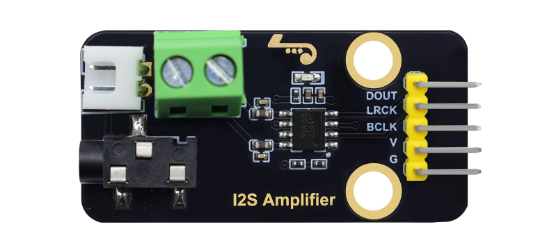

#### Description
This module uses the NS4168 chip: a high‑efficiency, low‑noise integrated Class‑D amplifier well‑suited for battery‑powered portable audio devices. It accepts I²S digital input and includes distortion‑limiting and multi‑layer protection features.

#### Features
1. **I²S Digital Input**: No external DAC required, simplifying system design.
2. **High‑Efficiency Class‑D**: Efficiency above 80 %, good for battery‑powered builds.
3. **Automatic Sample‑Rate Detection**: Supports 8 kHz‑96 kHz adaptive operation.
4. **Built‑in Digital High‑pass Filter**: Single‑pin control of corner frequency.
5. **Left / Right Channel Selectable**: Channel assignment via CTRL pin level.
6. **NCN Anti‑Clipping**: Suppresses audio clipping distortion.
7. **No Output Filter Required**: Reduces external component count.
8. **Protection Circuits**: Over‑current, over‑temperature and under‑voltage protection for safe operation.
9. **3.5 mm TRRS Jack**: Supports direct headphone or loudspeaker connection.

#### Main Specifications

| Parameter             | Value / Range       | Remarks                        |
|------------------|-------------------|-----------------------------|
| **Operating Voltage**     | 3.0 V ~ 5.5 V       | Typically 3.3 V or 5 V             |
| **Output Power**     | 2.5 W @4Ω (5 V)      | Depends on supply voltage and thermal conditions        |
| **Efficiency**         | >80 %     | Reduces power dissipation             |
| **Sample Rate**       | 8 kHz ~ 96 kHz      | Auto‑detection       |
| **THD+N**        | 0.2 % @1 W, 5 V, 4Ω  | Good audio fidelity                 |
| **Protection Features**     | Over‑temp / over‑current / under‑voltage | Enhances safety                   |
| **Module Dimensions**     | 48 mm × 24 mm       | Matched module form‑factor               |
| **Weight**         | 7.29 g             | Compact portable design               |
| **Package Form**     | eSOP8             | Enhanced thermal dissipation               |

> **Note**: Allow adequate cooling space. Match loudspeaker impedance (4Ω or 8Ω recommended). Set appropriate gain to avoid distortion or chip damage.

### 5. Enclosed‑Cavity Loudspeaker (8Ω 2 W )

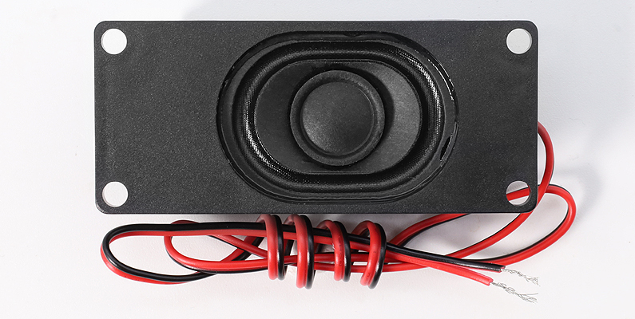

#### Introduction
This speaker works inside a partial‑ or fully‑enclosed cavity to improve low‑frequency response and acoustic energy focusing, widely used in portable smart‑audio devices.

#### Features
1. **Impedance‑Power Matching**: 8Ω impedance, 2 W rated power for small amplifiers.
2. **Improved Low‑Frequency Response**: Cavity design enhances bass performance.
3. **Compact Mechanical Design**: Mount via screws, snaps or adhesive tape.

#### Main Specifications

| Parameter          | Value / Range       | Remarks                              |
|---------------|-------------------|-----------------------------------|
| **Impedance**      | 8Ω           | Matches small‑form‑factor amplifiers              |
| **Rated Power**  | 2 W              | For normal‑volume playback                      |
| **Frequency Response**  | ~200 Hz ~ 20 kHz     | Cavity‑optimized mid‑low frequency response                |
| **Sensitivity**    | 80‑90 dB (@1 W/1 m)  | High acoustic efficiency              |
| **Mounting Method**  | Screws / snaps / adhesive tape    | Depends on physical variant                    |

> **Note**: Pair with a suitable digital amplifier and keep volume within reasonable limits to prevent overload and hardware damage.

---

### 6. 1.54‑inch IPS Color LCD Module

#### Introduction
The 1.54‑inch IPS color LCD is a high‑performance display module for embedded and portable projects. IPS panel technology delivers rich colors and excellent viewing‑angle performance.

#### Features
- **High Resolution**: 240 × 240 pixels for sharp visual output.
- **Rich Color Depth**: 65 K RGB color display.
- **Wide‑View‑Angle IPS Panel**: Consistent image quality across large viewing angles.
- **Simple 4‑Wire SPI Interface**: Requires minimal GPIO resources.
- **Broad Platform Compatibility**: Example code for STM32, C51, MSP430 available.
- **Robust Manufacturing Standards**: Reliable long‑term operation.

#### Product Parameters

| Item | Parameter |
| --- | --- |
| **Display Colors** | RGB 65 K color |
| **SKU** | MSP1541 |
| **Screen Size** | 1.54 inch |
| **Panel Technology** | TFT |
| **Driver IC** | ST7789 |
| **Resolution** | 240 × 240 pixels |
| **Interface** | 4‑line SPI |
| **Active Display Area** | 27.72 mm × 27.72 mm |
| **PCB Module Dimensions** | 32.00 mm × 43.72 mm |
| **Viewing Angle** | Full‑angle |
| **Operating Voltage** | 3.3 V |

## Hardware Wiring Instructions

All modules plug directly into dedicated connectors on the expansion board.

**Notice**: Different manufacturers may assign ESP32‑S3 board pins differently. Always refer to the silkscreen and official documentation for your specific board.

### Wiring Diagram

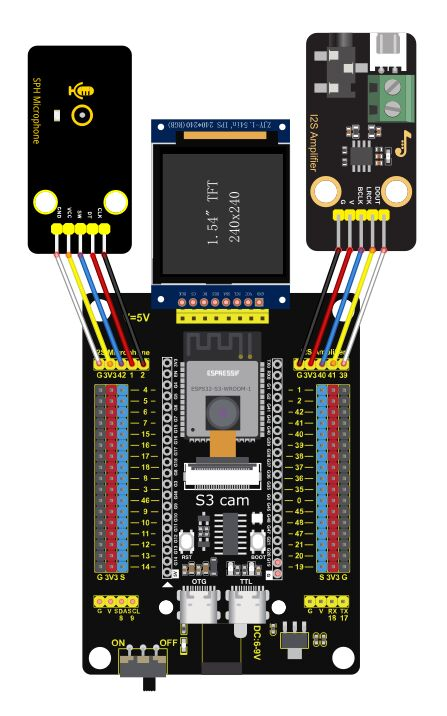

### Microphone Wiring (ICS‑43432 I²S Microphone)
| ESP32‑S3‑Cam Mainboard | ICS‑43432 Microphone |
| --- | --- |
| GPIO **1** | **WS** (Word Select) |
| GPIO **2** | **SCK** (Bit Clock) |
| GPIO **42** | **DIN** (Data Input) |
| **3V3** | **VDD** (Power, 3.3 V) |
| **GND** | **GND** (Ground) |

---

### Digital Power Amplifier Wiring (NS4168)
| ESP32‑S3‑Cam Mainboard | NS4168 Digital Amplifier |
| --- | --- |
| GPIO **39** | **DOUT** (Digital Audio Output) |
| GPIO **40** | **BCLK** (Bit Clock) |
| GPIO **41** | **LRCK** (Left‑Right Clock) |
| **3V3**| **VCC** (Power Input)  |
| **GND** | **GND** (Ground) |

---

### LCD Screen Wiring

| ESP32‑S3‑Cam Mainboard | 1.54‑inch IPS LCD |
| --- | --- |
| GPIO **19** | **SCL** (SPI Clock) |
| GPIO **20** | **SDA** (SPI MOSI Data) |
| GPIO **21** | **RES** (Reset Signal) |
| GPIO **47** | **DC** (Data / Command Select) |
| GPIO **45** | **CS** (Chip Select) |
| GPIO **38** | **BLK** (Backlight Control, high = ON) |
| **5V** | **VCC** (Power Supply) |
| **GND** | **GND** (Ground) |

---

### Assembly Flow

The camera connects via the 24‑pin FPC flat‑cable connector on the mainboard, no manual wiring required. Ensure metal contact surfaces face down when inserting the cable, then lock the FPC latch.

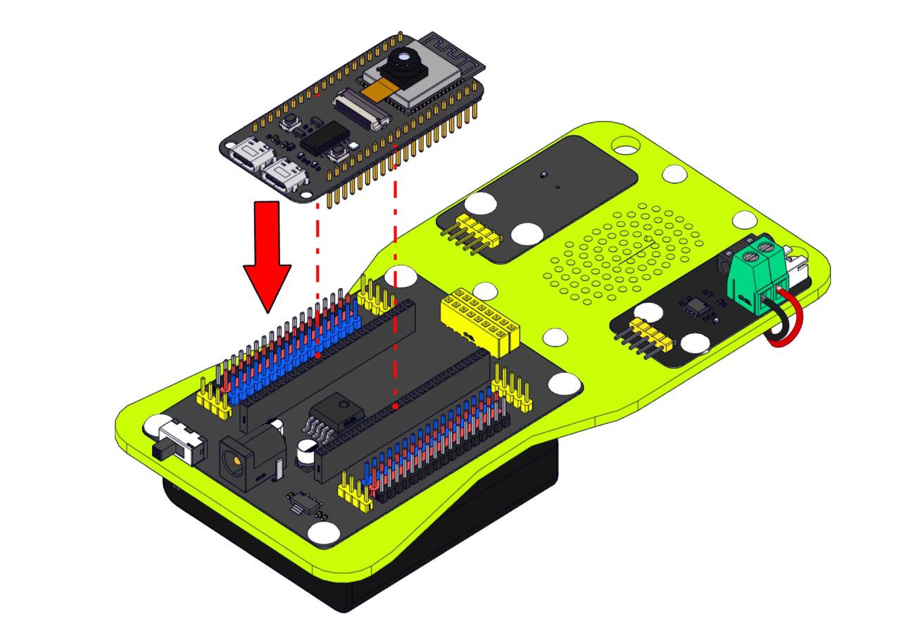

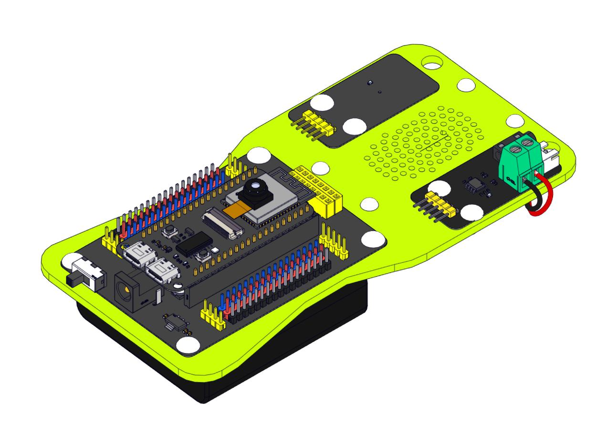

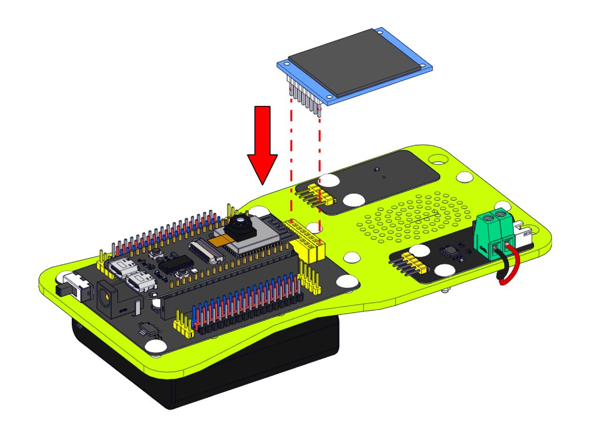

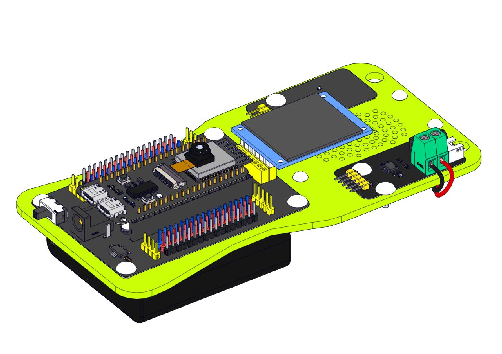

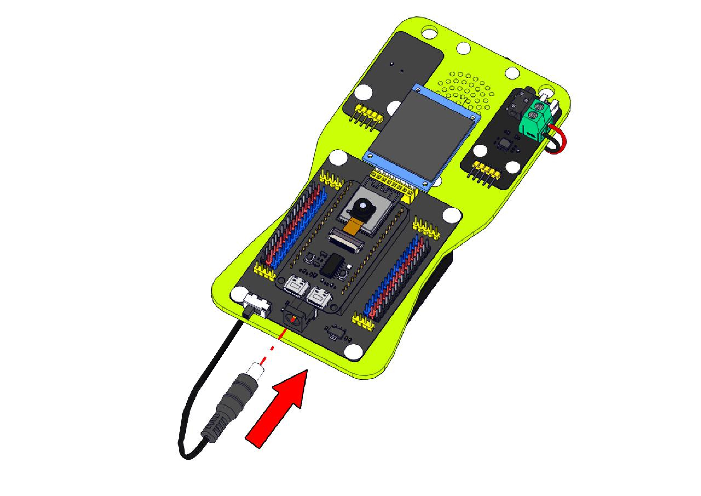

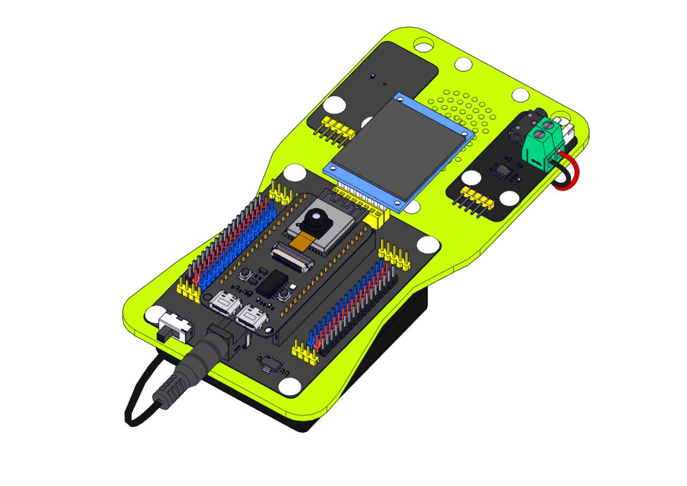

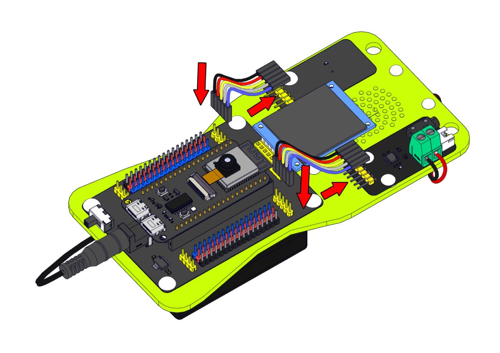

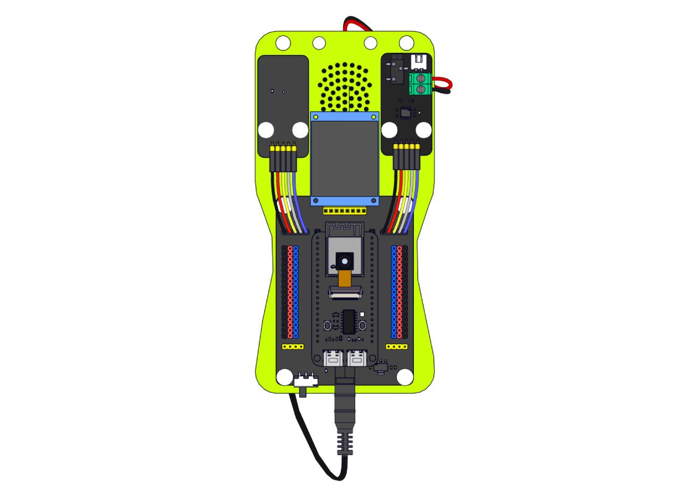

---

## Firmware Flashing

Two flashing methods are available: **Web‑based Online Flashing** and **Offline Download‑Tool Flashing**. Online flashing is recommended for simplicity.

---
### Method 1: Web‑based Online Flashing
No software installation required; flash firmware directly from a web browser.

**Pre‑requisites**
- **Browser**: Latest Google Chrome or Microsoft Edge.
- **USB Cable**: Must be a data‑capable USB‑C cable (charge‑only cables will not work).

**Flashing Steps**
1.  **Access the Flashing Page:** Open the online flashing URL in your browser: **https://flash.keyestudio.com/**  

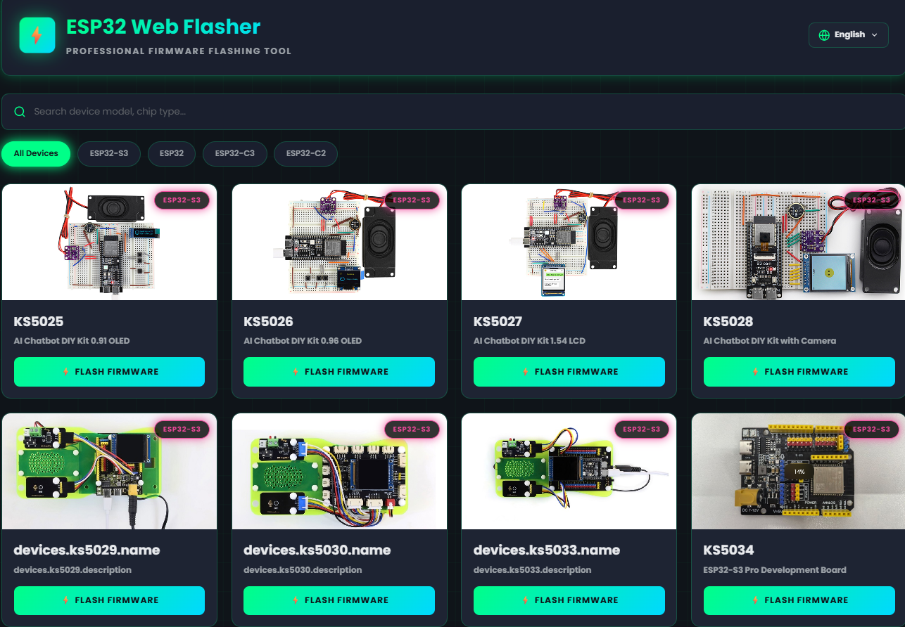

2.  **Connect Hardware**: Select the KS5038 preset. Connect the ESP32‑S3‑Cam kit to your PC with a USB‑C cable. Install the CH340 serial driver if required by clicking “Download Driver” in the upper‑left corner of the webpage.

3.  **Connect Device in Browser**:
    -   Click **Connect Device** on the webpage.
    -   A port‑selection popup appears. Choose your COM port and click connect.

4.  **Load Firmware**:
    -   Option A (Recommended): Download firmware from GitHub or Gitee. Select the latest firmware version and click **Download & Add**. Firmware loads automatically.
    -   Option B (Local File): Click **Upload Firmware** and select your local `.bin` firmware file.

5.  **Start Flashing**: After firmware is loaded, click **Start Flashing**.
6.  **Complete**: Wait for progress to finish until “Flash Success” appears in the log.

Press the **RST** reset button to reboot the board and enter Wi‑Fi provisioning mode.

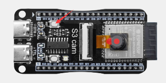

---

### Method 2: Flash Download Tool (No ESP‑IDF Environment Required)

**Important**: This procedure applies to the ESP32‑S3‑Cam firmware. Make sure you use the correct firmware binary for this board.

Download link for flashing‑tool package

 [**Flash‑Tool Archive**](FirmwareArchive.rar)

#### 1. Preparation
- **Operating System**: Windows recommended. Use Flash Download Tool version 3.9.7 or newer.
- **Tool Source**: Download from the [Espressif official website](https://www.espressif.com/en/support/download/other-tools). No installation required; unzip and run.

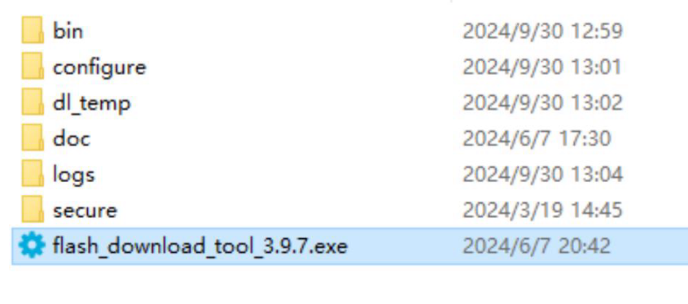

#### 2. Download Firmware

Download link for firmware archive

 [**Firmware Archive**](s3cam-3660.bin)

#### 3. Flash Firmware onto Development Board

Unzip and open `flash_download_tool` folder, run `flash_download_tool.exe`.

**1) Download Configuration**

1.  **ChipType**: Select `ESP32‑S3`
2.  **WorkMode**: Select `Develop`
3.  **Download Mode**: Select `UART`

**2) Load Firmware & SPI Download Settings**

1.  **Load Firmware File:** Click the `...` button in the first blank box and select the `.bin` firmware file for the CAM board you downloaded.  
2.  **Check and Address Setup:** Tick the checkbox next to the loaded `.bin` file and enter `0x0` or `0x00` in the address field, indicating that flashing starts from the beginning of the memory.  
3.  **Select COM Port:** Connect the board via Type-C cable to the PC. Check the corresponding **COM port number** in Windows Device Manager and select the same port in the tool.  
4.  **Set Baud Rate:** Choose a higher baud rate (e.g., `921600`) for faster flashing.  
5.  **Enter Download Mode:** **Press and hold the BOOT (or IO0) button on the ESP32-S3-CAM board, then press the RST button once, and finally release the BOOT button.**  
6.  **Start Flashing:** Click `START`. The progress bar will run. Wait until the **FINISH** success message appears.

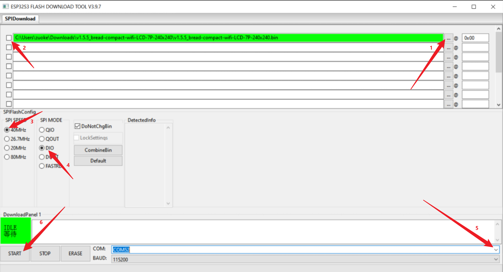

---

### Flashing Completed

After flashing, press the `RST` button on the development board to restart. The device will enter **Wi-Fi configuration mode**.

---

## How to Configure Device Wi-Fi

### 1. Wi-Fi Network Configuration

#### 1) Start Device
- After flashing firmware and rebooting, the device enters configuration mode.

#### 2) Configuration Status
- **sRGB LED blue blinking:** Indicates the device is in Wi-Fi configuration mode.  
- If the device is not in configuration mode, press and hold the **BOOT (or IO0)** button for a few seconds, or power cycle to enter configuration mode.

#### 3) Configuration Steps
1.  **Connect to "Xiao Zhi" Wi-Fi**  
    Use your phone or computer to search for Wi-Fi and connect to the device’s hotspot (usually named *Xiaozhi-XXXXXX*).  
    

2.  **Configure Network**  
    After connecting, the phone typically auto-displays the configuration page. If not, open a browser and navigate to `http://192.168.4.1`.  
      
    > - Select your 2.4G Wi-Fi network (5G is not supported).  
    > - Enter the Wi-Fi password and click **Connect**.  
    > - If the connection succeeds, the interface shows “Done,” and the device will reboot and connect to your Wi-Fi.

---

### 2. About the sRGB LED on the Device

1.  **Connection and Update Status**  
    -   **Blue flashing:** Device is in Wi-Fi configuration mode.  
    -   **Blue steady:** OTA firmware update in progress.  
    -   **Green flashing:** Wi-Fi connected successfully, waiting for wake-up.  
    -   **Blue light during voice wake-up:** Connecting to server.  
    -   **Green steady:** Playing voice.  
    -   **Red steady:** Recording audio.

2.  **sRGB LED Does Not Light**  
    -   Check if the development board power supply is normal.  
    -   Some boards may require additional soldering or jumper shorting to enable onboard sRGB LED, please check your board manual.

---

### 3. How to Add a Device

1. **Confirm Device Is Online**  
   - Once connected to the network, the device will announce a 6-digit verification code (can be retrieved by waking it up again).

2. **Access Control Panel**  
   - Open the [Xiao Zhi AI Chatbot - Control Panel](https://xiaozhi.me/) by entering [https://xiaozhi.me](https://xiaozhi.me) in your browser (register if you don’t have an account). Click the top right corner to switch to your preferred language.  
   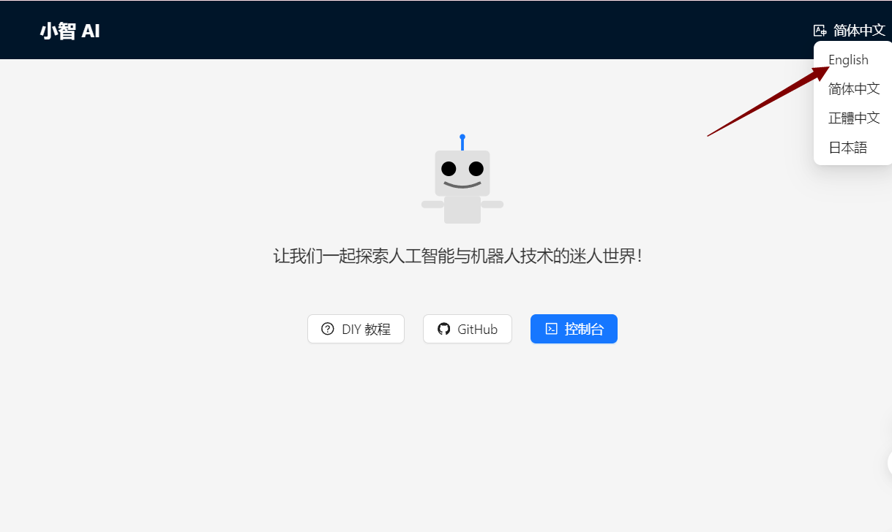

After changing the language, click **console** to enter the control panel.

3. **Device Management**  
   - Create an agent,  
   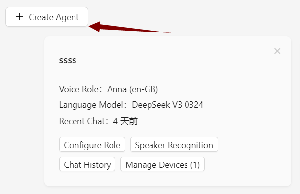

   - Set your agent's name.  
   

   - Click “Add New Device.”  
   
   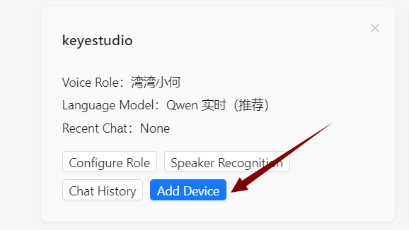  
   Enter the 6-digit **Device ID**.  

     

   **Where to get the Device ID:** After firmware upload and network setup succeed, the device will announce this six-digit code automatically.

4. **Activation Successful**  
   - The device will activate automatically and appear in the “Device Management” page. Click **Configure Role** to open the configuration interface.  
   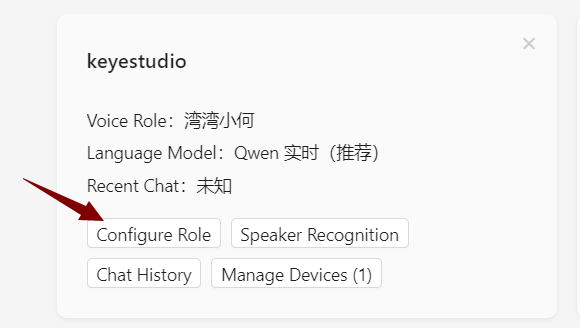

   - Set the assistant’s name and voice. In the Role Introduction section, you can use AI tools to write a character description as you like.  
   

   - Configure AI large models with several optional settings. After finishing, save your settings.  
   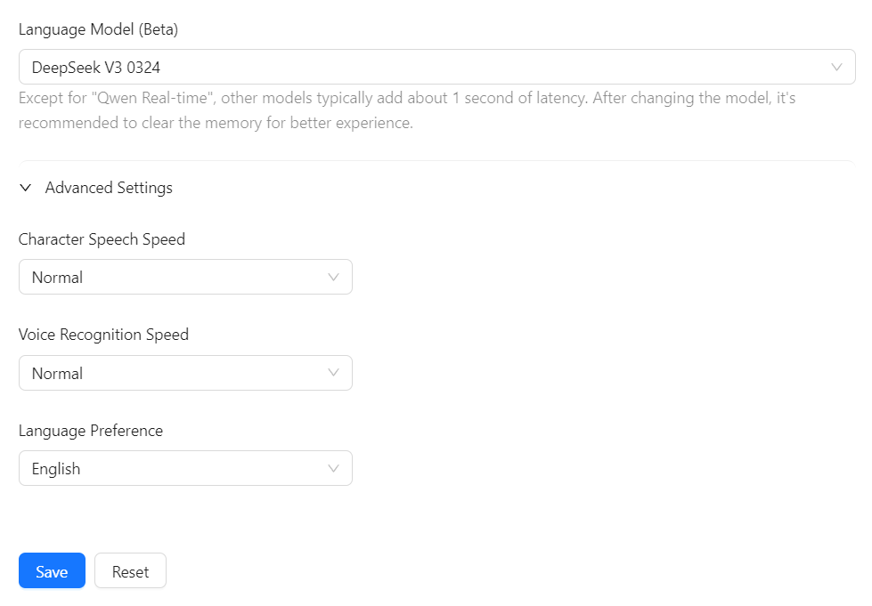

Restart the Xiao Zhi AI Chatbot and start chatting!

## FAQ – Common Troubleshooting

1. **No sound from speaker / microphone does not capture / LCD stays blank**
    - Confirm battery‑holder power switch is ON and power supply is stable. Check that modules are firmly inserted into correct dedicated ports (speaker, microphone, screen) with correct orientation.

2. **Device reboots frequently or fails to boot**
    - Low battery voltage is a common cause. Replace with fresh AA batteries if using battery‑holder power. Check battery polarity.

3. **XiaoZhi hotspot cannot be found during Wi‑Fi setup**
    - Confirm firmware flashed correctly. Press `RST` to reboot. If provisioning does not trigger automatically, long‑press `BOOT` button for several seconds to force provisioning‑mode entry.

4. **Firmware‑flash failure / cannot connect to board**
    - Verify you are using a data‑capable Type‑C cable (not charge‑only). Confirm serial driver installation. If problems persist: hold `BOOT`, press‑and‑release `RST`, release `BOOT` to enter download mode and retry flashing.

> **Tip**: All functional modules connect via unified expansion‑board ports. Double‑check modules are fully seated. If issues remain, confirm firmware version matches your hardware configuration.